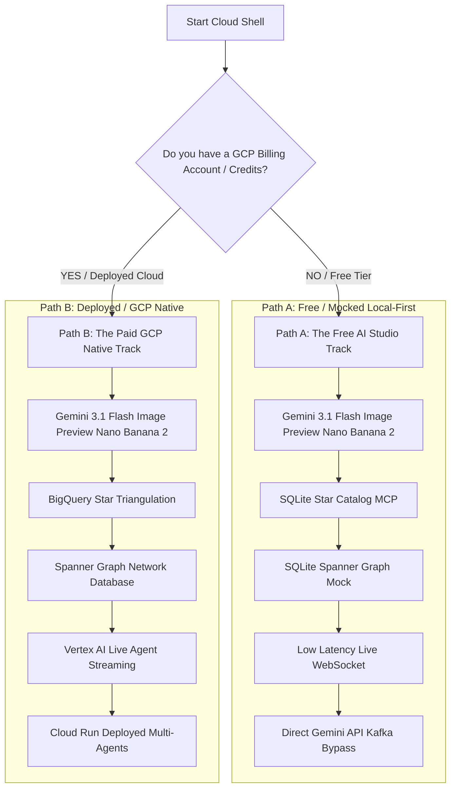

# 🛸 Way Back Home: Google Cloud Console Guided Walkthrough

Welcome to the **Way Back Home** AI Developer Workshop! In this adventure, you play a stranded space explorer on an uncharted planet. Your goal is to build, coordinate, and dispatch AI agents to find your exact coordinates, establish a survivor communication network, bypass automated biometric defenses, and coordinate your drone squadron to pave a flight pathway back home.

By running this workshop directly in **Google Cloud Shell** inside the **Google Cloud Console**, you bypass all local installation friction (no local Python setup, no Node.js version mismatches, and no local shell execution issues). Google Cloud Shell provides a **100% free, pre-configured development environment** accessible in any web browser!

---

## 🛠️ Step 0: Get Into Your Cloud Shell Environment

Before choosing your path, follow these exact steps to open your terminal in the cloud:

1. **Open Google Cloud Console**:
   * Open your web browser and go to: [https://console.cloud.google.com/](https://console.cloud.google.com/)
   * Sign in using your Google Account (or a workshop-provided account).
2. **Activate Cloud Shell**:
   * In the top-right corner of the Cloud Console header, click the **Activate Cloud Shell** icon (it looks like a terminal prompt `>_`).
   * A terminal pane will open at the bottom of your browser window. Wait a few seconds for your free Debian-based virtual machine to provision and connect.
3. **Open the Cloud Shell Editor (Optional but Highly Recommended)**:
   * To view and edit code visually, click the **Open Editor** button on the Cloud Shell toolbar. This opens a web-based VS Code environment!
   * Toggle back to the terminal by clicking **Open Terminal** at any time.

---

# 🚀 Choose Your Path

We have engineered two complete paths for this workshop. Select the one that matches your billing situation:



*   **[Path A: The Free AI Studio Track](#path-a-the-free-ai-studio-track-zero-billing-zero-credits)**: 100% Free. Uses a free Google AI Studio API Key and runs our local-first mocked infrastructure (SQLite, MockRedis, and direct Kafka API bypasses) completely inside the free Cloud Shell VM.
*   **[Path B: The Paid GCP Native Track](#path-b-the-paid-gcp-native-track-with-gcp-billingcredits)**: Uses actual deployed Google Cloud resources, Vertex AI, Cloud Run deployments, BigQuery tables, and service account IAM controls. Highly recommended if you have GCP credits or a billing account.

---

## Path A: The Free AI Studio Track (Zero Billing / Zero Credits)

This track runs entirely in the free Cloud Shell environment using a Google AI Studio developer key. It bypasses all GCP billing requirements, Docker container launches, and multi-node clusters.

### Step A1: Obtain Your Free AI Studio API Key
1. Go to Google AI Studio: [https://aistudio.google.com/](https://aistudio.google.com/)
2. Sign in with your Google account.
3. Click the **Get API Key** button in the top left corner, then click **Create API Key**.
4. Copy the generated key.

### Step A2: Clone the Code and Switch to the AI Studio Branch
In your Cloud Shell terminal, copy and paste the following commands to clone the code and switch to the specialized billing-free branch:

```bash
# Clone the repository
git clone https://github.com/giterinhub/way-back-home.git

# Enter the workshop directory
cd way-back-home

# Switch to the billing-free branch
git checkout feature/aistudio
```

### Step A3: Initialize Your Sub-Environment
We have written a smart initializer script that checks your tools, sets up Python virtual environments, and registers you automatically:

```bash
# Export your AI Studio key (replace with your actual copied key!)
export GEMINI_API_KEY="YOUR_COPIED_AI_STUDIO_KEY"

# Run the sandbox initializer
chmod +x ./scripts/student_sandbox.sh
./scripts/student_sandbox.sh
```
*Note*: During this step, you will be prompted for:
1. **Event Code**: Enter **`gdg`** (or the custom event code provided by the organizer).
2. **Explorer Name**: Choose your unique name (e.g. `explorer_john`).

This will create a `config.json` in your root directory and build your local python virtual environment.

---

### Step A4: Level 0 — Establish Your Identity (Avatar Generator)

1. **Customize Your Explorer**:
   Run the interactive styling script to select your space suit color and describe your explorer's appearance:
   ```bash
   # Move to level 0 directory
   cd level_0

   # Run the customization script (stores choices in config.json)
   python customize.py
   ```

2. **Implement & Run the Generator**:
   Implement the `TODO` image-generation chat steps inside `level_0/generator.py` (or view `solutions/level_0/generator.py` for inspiration). Then run the avatar generator:
   ```bash
   # Activate virtual environment
   source ../.venv/bin/activate

   # Install requirements
   pip install -r requirements.txt

   # Run the generator
   python generator.py
   ```
💥 **Result**: Gemini 3.1 Flash Image Preview (Nano Banana 2) via AI Studio will generate your high-res explorer portrait and map icon in `<10 seconds` for free! Open the shared map URL at [https://erinl.space](https://erinl.space) and search for your username to see yourself appearing on the planet map in real-time!

---

### Step A5: Level 1 — Triangulate Your Crash Site (SQLite Star MCP)
We replace heavy BigQuery cloud databases with an instant local SQLite star database:

```bash
# Move to level 1 directory
cd ../level_1

# Seed the local SQLite star database
python setup/star_catalog_sqlite.py

# Generate personalized soil, flora, and star evidence
python generate_evidence.py

# Enter the MCP server directory
cd mcp-server
pip install -r requirements.txt

# Start the FastMCP Local Server
python main.py
```
*Leave this running and open a new terminal in Cloud Shell by clicking the `+` icon on the terminal toolbar.*

In the new terminal window, navigate back and run the multi-agent consensus system:
```bash
cd way-back-home/level_1
source ../.venv/bin/activate
pip install -r requirements.txt

# Run the multi-agent system
python agent/agent.py
```
💥 **Result**: The agents query the local SQLite database via MCP in `<50ms` and apply a 2-of-3 majority consensus algorithm to verify your biome, successfully firing your rescue beacon!

---

### Step A6: Level 2 — Build the Survivor Network (Local Property Graph)
Build a search agent to query survivor connections in a local SQLite Spanner Graph mock:

```bash
# Move to Level 2
cd ../level_2

# Initialize Spanner mock database
chmod +x init.sh
./init.sh

# Start the search backend
python backend/main.py
```
💥 **Result**: Launch the visual survivor panel. Enter natural search queries like *"Who in the NW sector can help with communications?"* The agent parses GQL and lists matching survivors in real-time using free Gemini text embeddings.

---

### Step A7: Level 3 — Bypass the Biometric Lock (Uvicorn WebSocket)
Stream audio/video from your camera directly to the `gemini-3.1-flash-live-preview` Live WebSocket:

```bash
# Move to Level 3
cd ../level_3

# Initialize
chmod +x scripts/init.sh
./scripts/init.sh

# Start the live streaming server
python backend/app/main.py
```
💥 **Result**: Click **Web Preview** in the top-right corner of Cloud Shell, select **Preview on port 8080**, and grant camera/mic permissions. Speak or wave to the screen to crack the drone base firewalls with ultra-low `<100ms` latency!

---

### Step A8: Level 4 — Drone Assembly (MockRedis & A2A)
Assemble specialized scout drones with zero Redis container installations:

```bash
# Move to Level 4
cd ../level_4
chmod +x scripts/init.sh
./scripts/init.sh

# Start the assembly dispatcher
python backend/main.py
```
💥 **Result**: The dispatcher automatically queries in-memory MockRedis lists to assemble your drone and verify landing safety.

---

### Step A9: Level 5 — Coordinate Drones (Direct Kafka-Free Satellite)
Coordinate a 3D drone squadron without running Apache Kafka clusters:

```bash
# Move to Level 5
cd ../level_5
chmod +x scripts/init.sh
./scripts/init.sh

# Start the satellite controller
python satellite/main.py
```
💥 **Result**: Choose **Web Preview** on **port 8080** to see your flight dashboard. Selecting a shape (e.g. `STAR`) sends the coordinates directly to `gemini-3.5-flash-preview` via standard REST, immediately generating a gorgeous, real-time 3D flight animation around your beacon!

---

## Path B: The Paid GCP Native Track (With GCP Billing/Credits)

This track deploys actual Google Cloud resources (Vertex AI APIs, Cloud Run instances, BigQuery databases, and IAM Service Accounts). It matches standard production DevOps environments.

### Step B1: Configure Your Google Cloud Project
Ensure you have a Google Cloud Project with an active billing account linked:
```bash
# Check if you are authenticated in Cloud Shell
gcloud auth list

# Set your active project ID
gcloud config set project YOUR_PROJECT_ID
```

### Step B2: Clone the Code and Switch to Main
```bash
# Clone the repository
git clone https://github.com/giterinhub/way-back-home.git
cd way-back-home

# Switch to the native GCP branch
git checkout main
```

### Step B3: Register Your Explorer Profile
Run the native workshop setup. This connects you to the cloud rescue network, enables APIs, and creates a service account:

```bash
# Run the setup script
chmod +x ./scripts/setup.sh
./scripts/setup.sh
```
*Note*: During this step, enter the Event Code **`gdg`** and choose your custom explorer name! This script will automatically create a local `config.json` containing your project details.

---

### Step B4: Level 0 — Vertex AI Avatar Generation

1. **Customize Your Explorer**:
   Run the interactive styling script to select your space suit color and describe your explorer's appearance:
   ```bash
   cd level_0
   python customize.py
   ```
   This stores your personalized preferences inside `config.json`.

2. **Implement & Run the Generator**:
   Open `level_0/generator.py`. Fill in the image-generation chat steps. Then execute the generator:
   ```bash
   source ../.venv/bin/activate
   pip install -r requirements.txt

   # Run generator in Vertex AI mode
   python generator.py
   ```
💥 **Result**: The chat session generates a consistent portrait and map icon using the Cloud Vertex AI Image API.

---

### Step B5: Level 1 — BigQuery Star Triangulation & Cloud Run MCP
Deploy a custom botanical analyst MCP server to Cloud Run and query a BigQuery star catalog:

```bash
cd ../level_1

# Run environment setup (enables Cloud Run, Artifact Registry, BigQuery and IAM permissions)
chmod +x setup/setup_env.sh
./setup/setup_env.sh

# Source variables
source ../set_env.sh

# Upload and seed the BigQuery star catalog
python setup/setup_star_catalog.py

# Generate crash site multimodal evidence
python generate_evidence.py

# Build and Deploy the MCP Server to Cloud Run
cd mcp-server
gcloud builds submit . \
  --config=cloudbuild.yaml \
  --substitutions=_REGION="$REGION",_REPO_NAME="$REPO_NAME",_SERVICE_ACCOUNT="$SERVICE_ACCOUNT"

# Retrieve and save your Cloud Run URL
export MCP_SERVER_URL=$(gcloud run services describe location-analyzer \
  --region=$REGION --format='value(status.url)')
```

Now, navigate back and start the orchestrator root agent that queries BigQuery via MCP:
```bash
cd ..
source ../.venv/bin/activate
python agent/agent.py
```
💥 **Result**: The agent calls your deployed Cloud Run server and connects to the managed BigQuery MCP tool to triangulate coordinates.

---

### Step B6: Level 2 — Deployed Spanner Graph Survivor Network
Initialize and deploy a Spanner instance, database, and a vector search service on Cloud Run:

```bash
cd ../level_2

# Initialize GCP Spanner and Database
chmod +x init.sh
./init.sh

# Deploy backend to Cloud Run
chmod +x deploy_cloud_run.sh
./deploy_cloud_run.sh
```
💥 **Result**: Deploys a production property graph. Querying the search dashboard calls Spanner and executes vector embeddings utilizing standard Vertex AI.

---

### Step B7: Level 3 — Deployed Voice Override Panel
```bash
cd ../level_3

# Setup Cloud Run and IAM permissions
chmod +x scripts/init.sh
./scripts/init.sh

# Start the uvicorn WebSocket server
python backend/app/main.py
```
💥 **Result**: Uses the Vertex AI Live Agent Streaming endpoints programmatically to process audio/video frames.

---

### Step B8: Level 4 — Deployed Drone Assembly (Real Redis & Cloud Run A2A)
Deploy a Redis container and architect/dispatch agents to Cloud Run:

```bash
cd ../level_4
chmod +x scripts/init.sh
./scripts/init.sh

# Deploys Redis to Cloud Run and starts agent-to-agent dispatch
python backend/main.py
```
💥 **Result**: Real-time Redis caches design schematics in the cloud, while agents authenticate using secure service-to-service IAM bindings!

---

### Step B9: Level 5 — Deployed Flight Coordination (Kafka Streaming Cluster)
Spin up a Kafka streaming cluster and deploy a formation controller:

```bash
cd ../level_5
chmod +x scripts/init.sh
./scripts/init.sh

# Starts the satellite streaming dashboard
python satellite/main.py
```
💥 **Result**: Stream coordinate points through a live Apache Kafka message queue, animating your scout drones around the 3D map!

---

## 🎉 Mission Accomplished!

Regardless of which path you chose, you have completed the **Way Back Home** Developer Workshop entirely inside the web-based Google Cloud Shell! 🚀
