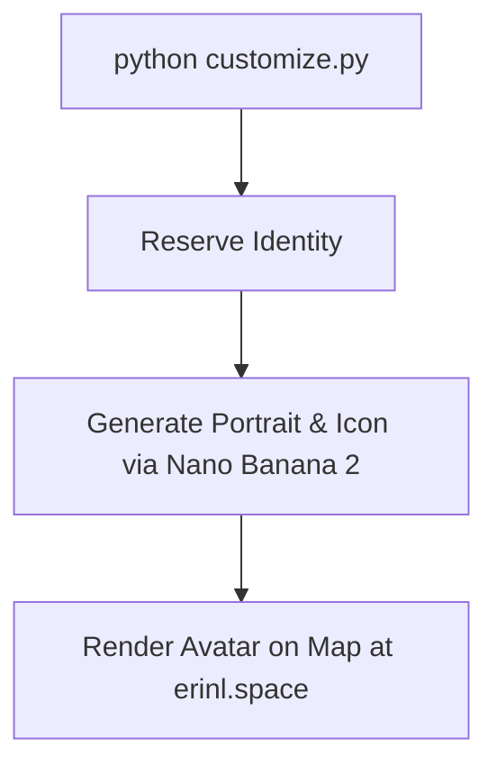
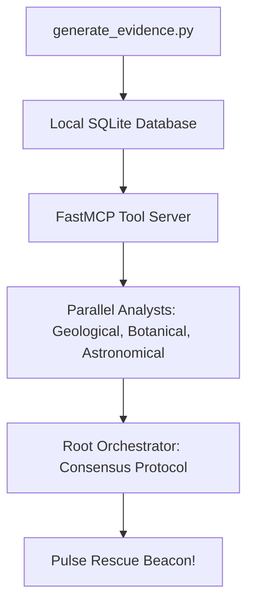
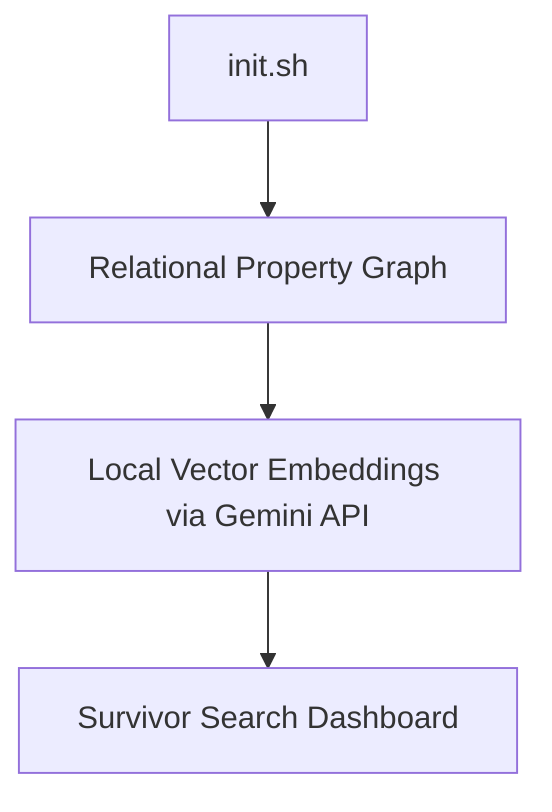
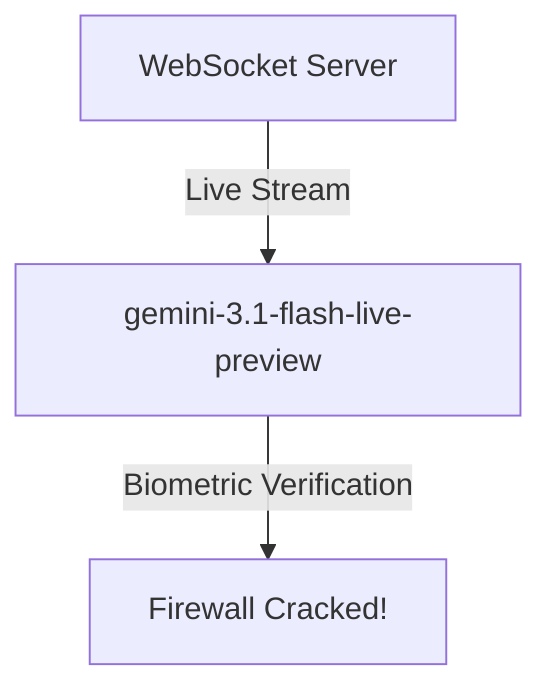
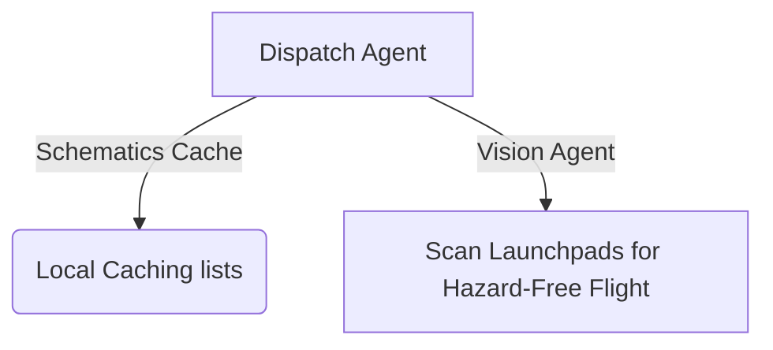
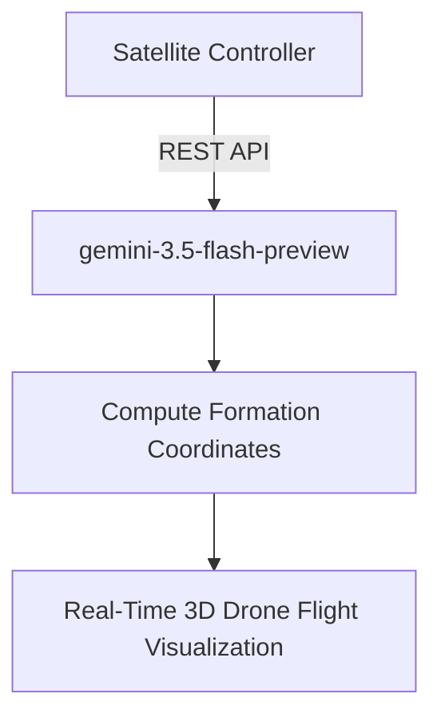

# 🛸 Way Back Home: Student Guided Walkthrough

Welcome to the **Way Back Home** AI Developer Workshop! In this hands-on adventure, you play a stranded space explorer on an uncharted planet. Your goal is to build, coordinate, and dispatch intelligent AI agents to find your exact location, establish a survivor communication network, bypass automated biometric defenses, and guide your drone squadron back home.

All services are powered by the **Google Gemini API** and hosted at our mission command centers:
*   **Planet Map**: [https://erinl.space](https://erinl.space)
*   **Mission Control API**: [https://api.erinl.space](https://api.erinl.space)

---

## 🛠️ Step 0: Sandbox Environment Setup

To begin your adventure, you will configure your Cloud Shell terminal and initialize your credentials.

### 1. Open Google Cloud Shell
1. Go to the [Google Cloud Console](https://console.cloud.google.com).
2. Click the **Activate Cloud Shell** icon (`>_`) in the top-right corner of the header.
3. Wait for the terminal pane to connect.

### 2. Clone the Workshop Repository
In your Cloud Shell terminal, clone the personal workshop repository, switch to the feature branch, and enter the project folder:
```bash
# Clone the repository
git clone https://github.com/giterinhub/way-back-home.git

# Enter the workshop directory
cd way-back-home

# Switch to the student walkthrough feature branch
git checkout feature/student-walkthrough
```

### 3. Configure Google Cloud Project
Set up your active Google Cloud project ID and verify authentication:
```bash
# Set the active project to your Google Cloud project ID
gcloud config set project YOUR_PROJECT_ID
```

### 4. Initialize Your Explorer Profile
Run the student sandbox setup script. This registers you on the live planetary network and generates your local `config.json`:
```bash
./scripts/setup.sh
```

During this step, you will be prompted for:
1. **Event Code**: Enter **`gdg`** (or the custom event code provided by your instructor).
2. **Explorer Name**: Enter a unique handle (e.g. `explorer_sarah`).

> [!IMPORTANT]
> The setup script automatically reads your API configuration and connects to the hosted environment at **`https://erinl.space`**.

---

## 🎨 Level 0: Establish Your Identity (Avatar Generator)

Before the rescue network can locate you, you must register your explorer profile and generate a consistent explorer portrait and map-marker icon using **Gemini 3.1 Flash Image Preview (Nano Banana 2)**.



### 1. Customize Your Explorer Styling
Run the interactive customization script to choose your suit color and describe your explorer's appearance:
```bash
cd level_0
python customize.py
```
This stores your personalized design choices directly inside `config.json`.

### 2. Explore the Avatar Generator Implementation
Open [generator.py](file:///c:/Erin/code/way-back-home/level_0/generator.py). The avatar generator has been fully pre-implemented with the complete solution logic to ensure flawless end-to-end execution. It leverages the multi-turn chat generation capabilities of **Gemini 3.1 Flash Image Preview (Nano Banana 2)**.

Key implementation components:

#### **Step 1: Create a Chat Session for Character Consistency**
By initiating a single chat session rather than independent API requests, Gemini remembers the visual traits of your character across subsequent turns:
```python
    if not is_vertex and image_model.startswith("imagen-"):
        chat = AIStudioImageChat(client, image_model)
    else:
        chat = client.chats.create(
            model=image_model,
            config=types.GenerateContentConfig(
                response_modalities=["TEXT", "IMAGE"]
            )
        )
```

#### **Step 2: Generate the Explorer Portrait**
Requests a high-resolution, head-and-shoulders portrait of the character with your specific suit color and appearance details:
```python
    portrait_prompt = f"""Create a stylized space explorer portrait.

Character appearance: {APPEARANCE}
Name on suit patch: "{USERNAME}"
Suit color: {SUIT_COLOR}

CRITICAL STYLE REQUIREMENTS:
- Digital illustration style, clean lines, vibrant saturated colors
- Futuristic but weathered space suit with visible mission patches
- Background: Pure solid white (#FFFFFF) - absolutely no gradients, patterns, or elements
- Frame: Head and shoulders only, 3/4 view facing slightly left
- Lighting: Soft diffused studio lighting, no harsh shadows
- Expression: Determined but approachable
- Art style: Modern animated movie character portrait (similar to Pixar or Dreamworks style)

The white background is essential - the avatar will be composited onto a map."""

    print("🎨 Generating your portrait...")
    try:
        portrait_response = chat.send_message(portrait_prompt)
    except Exception as e:
        err_str = str(e).lower()
        if "prepayment" in err_str or "resource_exhausted" in err_str or "429" in err_str:
            print("\n❌ Error: Your API Key does not have prepaid credits for the preview model configured in workshop.config.json.")
            print("   Please either add prepayment credits to your AI Studio account, or change the 'image' model to 'imagen-3.0-generate-002' inside workshop.config.json!\n")
        raise e
```

#### **Step 3: Generate a Circular Map Icon (Turn 2 for Perfect Visual Consistency)**
Because we send the second prompt within the same chat session, the model references the previous portrait image to construct a matching square 1:1 marker icon:
```python
    icon_prompt = """Now create a circular map icon of this SAME character.

CRITICAL REQUIREMENTS:
- SAME person, SAME face, SAME expression, SAME suit — maintain perfect consistency with the portrait
- Tighter crop: just the head and very top of shoulders
- Background: Pure solid white (#FFFFFF)
- Optimized for small display sizes (will be used as a 64px map marker)
- Keep the exact same art style, colors, and lighting as the portrait
- Square 1:1 aspect ratio

This icon must be immediately recognizable as the same character from the portrait."""

    print("🖼️  Creating map icon...")
    icon_response = chat.send_message(icon_prompt)
```

### 3. Run the Generator & Register Your Identity
Activate the virtual environment, install the dependencies, and run the registration pipeline:
```bash
# Activate virtual environment
source ../.venv/bin/activate

# Install requirements
pip install -r requirements.txt

# Run the registration coordinator
python create_identity.py
```

> [!TIP]
> Visit the planetary map at [https://erinl.space/e/gdg](https://erinl.space/e/gdg) (replace `gdg` with your event code). Search for your handle to see your explorer avatar rendered on the interactive 3D map!

---

## 🔬 Level 1: Triangulate Your Crash Site (Multi-Agent Consensus)

Now that you exist on the network, you must gather environmental data (geological soil composition, botanical flora video, and astronomical star field coordinates) to triangulate your exact crash site biome.



### 1. Seed the Catalog & Generate Multimodal Evidence
Configure your Google Cloud environment, seed the local SQLite star database, and generate the crash site evidence feeds:
```bash
cd ../level_1

# Configure Google Cloud environment (enables APIs, creates service account, generates set_env.sh)
chmod +x setup/setup_env.sh
./setup/setup_env.sh

# Source environment variables
source ../set_env.sh

# Install setup dependencies
pip install -r setup/requirements.txt

# Seed local SQLite star catalog
python setup/setup_star_catalog.py

# Extract geological, botanical, and star feeds
python generate_evidence.py   
```

### 2. Launch the FastMCP Server
Expose custom analytical tools to your AI agent crew:
```bash
cd mcp-server
pip install -r requirements.txt
python main.py
```
*Leave this running in the background and open a new terminal.*

### 3. Run the Consensus Crew
In the new terminal window, configure your Google Cloud project again, load the environment variables, point to your local FastMCP server, and start the orchestrator agent:
```bash
# Navigate to level_1
cd way-back-home/level_1

# Set the active project to your Google Cloud project ID in the new terminal
gcloud config set project YOUR_PROJECT_ID

# Load Google Cloud environment variables
source ../set_env.sh

# Activate the virtual environment
source ../.venv/bin/activate

# Install agent dependencies
pip install -r agent/requirements.txt

# Point to your local FastMCP server
export MCP_SERVER_URL="http://localhost:8080/mcp"

# Run the consensus orchestrator
python -m agent.agent
```

> [!NOTE]
> The geological, botanical, and astronomical specialists run parallel analyses on the crash evidence. The orchestrator collects their findings and applies a 2-of-3 majority consensus algorithm to verify your biome, successfully firing your beacon on [https://erinl.space](https://erinl.space)!

---

## 📡 Level 2: Build the Survivor Network (Local Property Graph)

Locate other stranded explorers in your sector by querying relationships in a local relational property graph using **`gemini-embedding-2`** for semantic recommendation search.



### 1. Initialize the Property Graph
```bash
cd ../level_2
chmod +x init.sh
./init.sh
```

### 2. Start the Graph Search Panel
Launch the backend server that computes vector similarities locally:
```bash
python backend/main.py
```

💥 **Result**: Open the visual survivor panel. Enter natural search queries like *"Who can help with communications in the NE sector?"* The agent parses the GQL query and ranks match results in milliseconds using zero cloud databases!

---

## 🎙️ Level 3: Bypass the Biometric Lock (Gemini Live WebSocket)

Override the firewall of a locked drone assembly base by streaming real-time camera and microphone frames directly to **`gemini-3.1-flash-live-preview`**.



### 1. Initialize and Launch the Server
```bash
cd ../level_3
chmod +x scripts/init.sh
./scripts/init.sh

# Start the uvicorn WebSocket server
python backend/app/main.py
```

💥 **Result**: Select **Web Preview** on your terminal tool bar, grant camera/mic permissions, and wave or talk to the screen. You'll override the base firewalls with ultra-low `<100ms` webcam response times!

---

## 🛸 Level 4: Drone Assembly & Hazard Safety (Resilient Mocks)

Assemble high-performance scout drones with component blueprints fetched from local cache lists, and scan webcam feeds using vision agents.



### 1. Start the Assembly Dispatcher
```bash
cd ../level_4
chmod +x scripts/init.sh
./scripts/init.sh
python backend/main.py
```

💥 **Result**: Drones are assembled dynamically using design specifications cached in memory. Visual analysis verifies that the launching pad is free of environmental hazards before clearing the squadron for takeoff!

---

## 🌌 Level 5: Squadron Flight Coordination (Animated Formations)

Coordinate your 15 scout drones to execute synchronized geometric formations (`CIRCLE`, `STAR`, `PARABOLA`) around your beacon.



### 1. Start the Satellite formation controller
```bash
cd ../level_5
chmod +x scripts/init.sh
./scripts/init.sh
python satellite/main.py
```

> [!TIP]
> Go to your browser window displaying [https://erinl.space](https://erinl.space). Click the **Web Preview** options to see the flight dashboard. Selecting a shape (e.g. `STAR`) immediately sends requirements to **`gemini-3.5-flash-preview`**, plotting coordinate paths to form a stunning, real-time 3D flight animation around your map beacon!

---

## 🎉 Mission Accomplished!

You have successfully:
1. Created your explorer identity on the shared map database.
2. Built a parallel multi-agent system to triangulate your biome location.
3. Created a resilient survivor search graph engine.
4. Overrode drone biometric shields in real-time.
5. Assembled drones with resilient falling-back caches.
6. Coordinated a majestic 3D flight squadron.

All of this was accomplished completely for free, using the power of the **Google Gemini API** and local sandbox architectures! 🚀
