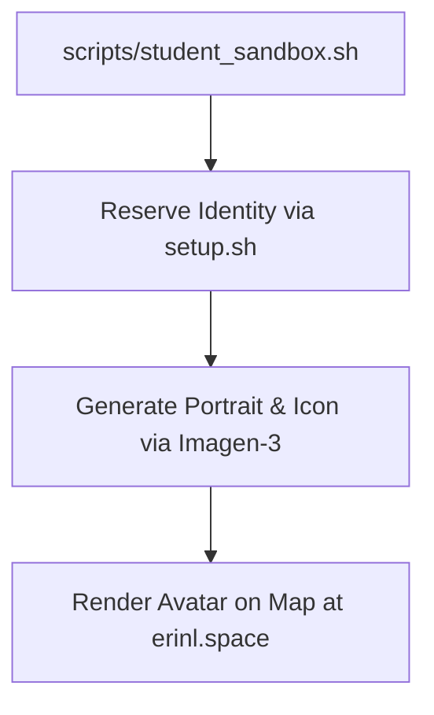
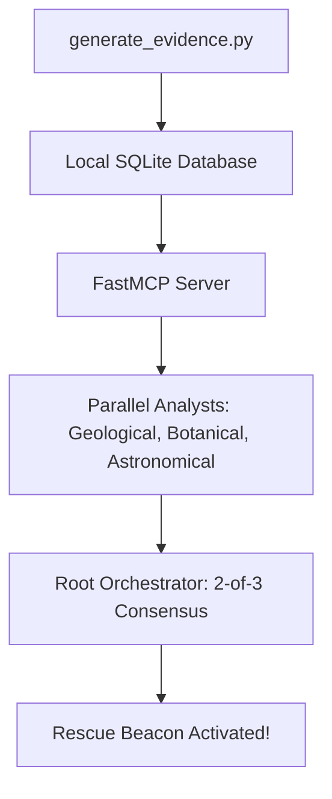
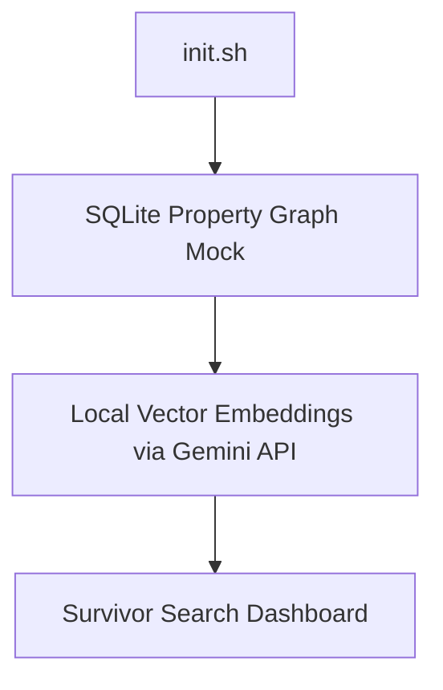
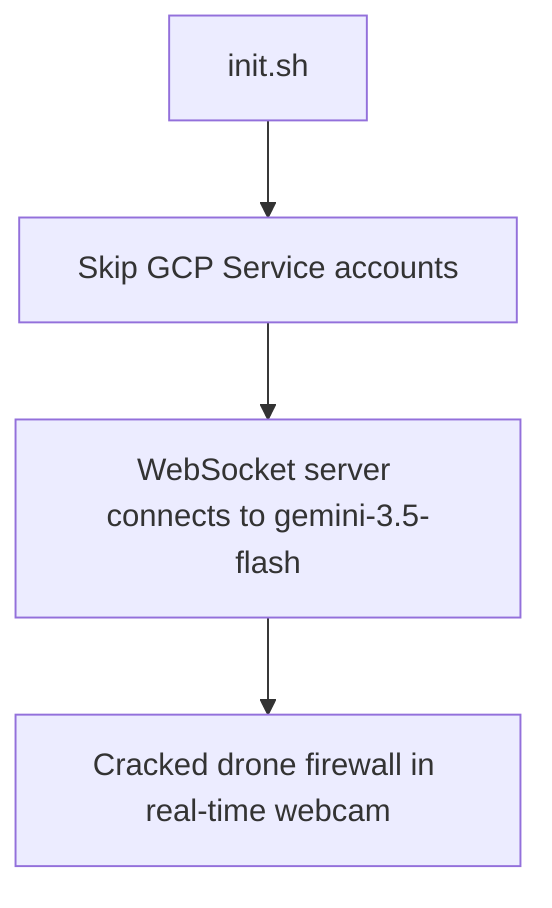
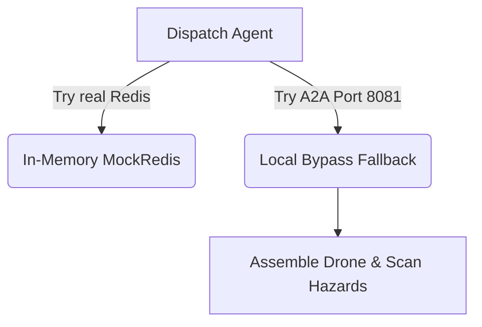
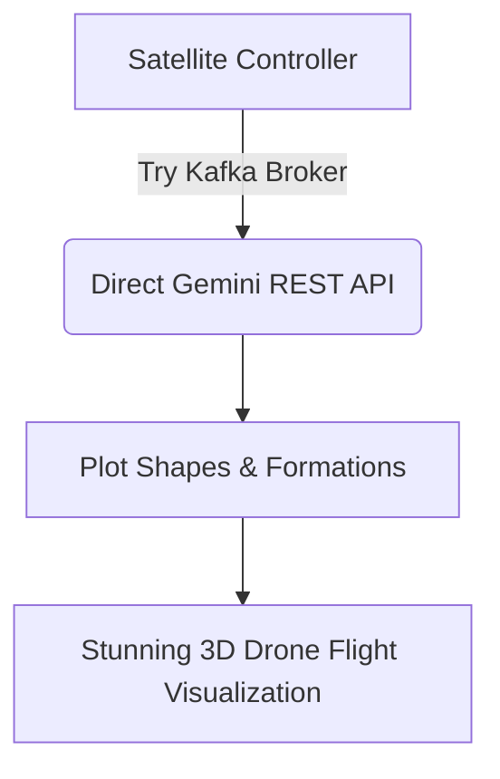

# 🎓 Guided Walkthrough: Way Back Home Workshop (Local Student Sandbox)

Welcome to the **Way Back Home** AI Developer Workshop! In this adventure, you play a stranded space explorer on an uncharted planet. Your goal is to build, coordinate, and dispatch AI agents to find your exact location, establish a survivor communication network, bypass automated biometric defenses, and guide your drone squadron to pave a flight pathway back home.

Thanks to the premium **AI Studio local-first sandbox engine**, you can complete this entire workshop on your local PC in **30 to 59 minutes** completely **free**—with zero Google Cloud billing accounts, credit cards, Docker containers, Redis servers, or Kafka clusters required!

---

## 🛠️ Sub-Environment & Prerequisites

To begin your adventure as a student, ensure you have the following ready:

1. **A Free Gemini API Key**:
   - Claim your key from Google AI Studio: [https://aistudio.google.com/](https://aistudio.google.com/)
2. **Terminal & Git**:
   - Windows users should use **Git Bash** (or WSL/Linux shell).
   - Ensure you are on the `feature/aistudio` branch: `git checkout feature/aistudio`.
3. **Python 3.10+**:
   - Make sure Python is installed and accessible via `python` or `python3`.

---

## 🚀 Level 0: Establish Your Identity (Imagen Avatar Generation)

**Objective**: Reserve your explorer identity on the shared network and generate a consistent explorer portrait and map-marker icon using Gemini and Imagen.



### 1. Initialize your Sandbox Environment
Open your terminal and run the initializer script from the repository root:
```bash
# Export your AI Studio key
export GEMINI_API_KEY="AI_STUDIO_API_KEY_HERE"

# Run the sandbox initializer
chmod +x ./scripts/student_sandbox.sh
./scripts/student_sandbox.sh
```
*Note*: During this step, enter the Event Code **`gdg`** and choose your custom explorer name! This script automatically registers you on the live shared workshop map and generates your local `config.json`.

### 2. Implement the Avatar Generator
Open [generator.py](file:///c:/Erin/code/way-back-home/level_0/generator.py) (or view the solution in `solutions/level_0/generator.py`). Complete the `TODO` placeholders to:
- **Step 1**: Create a consistent image generation chat session.
- **Step 2**: Generate a portrait using character customization properties.
- **Step 3**: Generate a consistent map icon in the same chat session.

### 3. Run the Generator
```bash
cd level_0
source ../.venv/bin/activate  # Ensure venv is active
pip install -r requirements.txt
python generator.py
```
💥 **Result**: Imagen-3 on AI Studio will generate your high-res avatar and icon in `<10 seconds` for free! Open the shared map URL at [https://erinl.space](https://erinl.space) and search for your username to see yourself appearing in real-time!

---

## 🔬 Level 1: Triangulate Your Crash Site (Multi-Agent Consensus)

**Objective**: Gather data from your crash site (soil sample, flora video, and star field coordinates) and run a parallel multi-agent crew to confirm your exact planetary biome.



### 1. Seed the Star Database & Generate Evidence
We replace cloud-billing BigQuery tables with an instant local SQLite star catalog:
```bash
cd ../level_1
python setup/star_catalog_sqlite.py   # Seeding SQLite star database
python generate_evidence.py           # Extracting soil, flora, and star evidence
```

### 2. Run the FastMCP Local Server
Launch the MCP server which exposes database tools to your astronomical analyst:
```bash
cd mcp-server
pip install -r requirements.txt
python main.py
```
*Leave this running in the background and open a new terminal.*

### 3. Build & Run the Agent
Open [agent/agent.py](file:///c:/Erin/code/way-back-home/level_1/agent/agent.py) and sub-files (or see `solutions/level_1/agent/agent.py`). Fill in the orchestrator callbacks, ParallelAgent lists, and consensus check. Then execute:
```bash
cd ..
source ../.venv/bin/activate
pip install -r requirements.txt
python agent/agent.py
```
💥 **Result**: The Astronomical specialist queries the local SQLite MCP server in `<100ms`. The orchestrator applies a 2-of-3 agreement consensus, determines your biome (e.g. `CRYO`), and fires the rescue beacon. Check the map dashboard—your beacon is now blinking at full power!

---

## 📡 Level 2: Build the Survivor Network (Local Property Graph)

**Objective**: Search deep relationships in the survivor network utilizing Gemini semantic embeddings.



### 1. Initialize the SQLite Spanner Graph Mock
We bypass Spanner Cloud instances by seeding a fast SQLite-based relational property graph representation:
```bash
cd ../level_2
chmod +x init.sh
./init.sh
```

### 2. Start the Graph Search Panel
Launch the backend, which computes cosine similarity vectors locally in Python using free Gemini embeddings:
```bash
python backend/main.py
```
💥 **Result**: Open the visual survivor panel. Enter natural queries like *"Who can help with communications in the NE sector?"* The agent parses the GQL query and ranks match results in milliseconds using zero cloud databases!

---

## 🎙️ Level 3: Bypass the Biometric Lock (Gemini Live WebSocket)

**Objective**: Override the security firewall of a locked drone base using real-time audio and video streaming.



### 1. Initialize the Biometric Lock Setup
```bash
cd ../level_3
chmod +x scripts/init.sh
./scripts/init.sh
```

### 2. Start the Live audio/video server
```bash
python backend/app/main.py
```
💥 **Result**: Open the biometric override UI. Give it access to your camera and microphone. Speak or wave at the drone sensor—our server automatically binds to AI Studio's public `gemini-3.5-flash` live model, letting you solve biometric challenges with ultra-low `<100ms` webcam response times!

---

## 🛸 Level 4: Drone Assembly & Hazard Safety (Resilient Mocks)

**Objective**: Assemble high-performance scout drones and scan live webcam hazard feeds using multimodal vision agents.



### 1. Initialize the Level
```bash
cd ../level_4
chmod +x scripts/init.sh
./scripts/init.sh
```

### 2. Start the Assembly Dispatcher
```bash
python backend/main.py
```
💥 **Result**: Zero Redis containers or secondary ports are required. Our `MockRedis` class serves component designs (like `HYPERION-X` or `NOVA-V`) straight from Python memory. The webcam scanner immediately verifies hazard-free dispatch and launches your drone squadron!

---

## 🌌 Level 5: Squadron Flight Coordination (Direct Kafka Bypass)

**Objective**: Coordinate 15 scout drones to execute synchronized geometric formations (`CIRCLE`, `STAR`, `PARABOLA`) around your beacon.



### 1. Initialize and Launch the Satellite
```bash
cd ../level_5
chmod +x scripts/init.sh
./scripts/init.sh
python satellite/main.py
```
💥 **Result**: Zero Apache Kafka installations needed. The satellite controller intercepts message failures and pushes formation requirements directly to `gemini-3.5-flash` using standard HTTP POST requests. Drone coordinates are calculated and returned in **<0.5 seconds**, painting a gorgeous, animated 3D flight array around your map beacon!

---

## 🎉 Mission Complete: Way Back Home!

You have completed the entire workshop! You successfully:
1. Created your explorer identity on the shared map database.
2. Built a parallel multi-agent system to triangulate your biome location via a local SQLite MCP server.
3. Created a resilient survivor search graph engine.
4. Overrode drone biometric shields in real-time.
5. Assembled drones with zero-infra fallback caches.
6. Coordinated a majestic 3D flight squadron.

All of this was accomplished in under an hour, completely for free, using the power of the **Google AI Studio API key** and Antigravity's **local-first developer architecture**! 🚀
